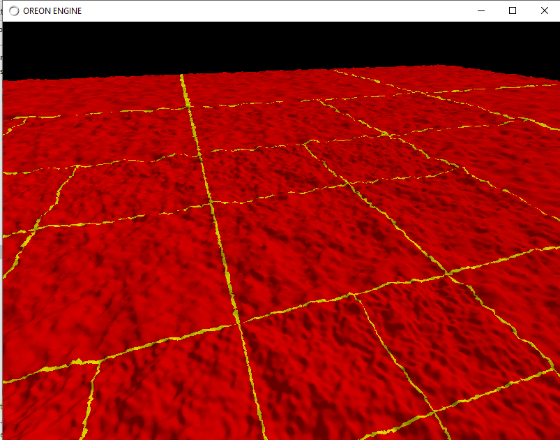
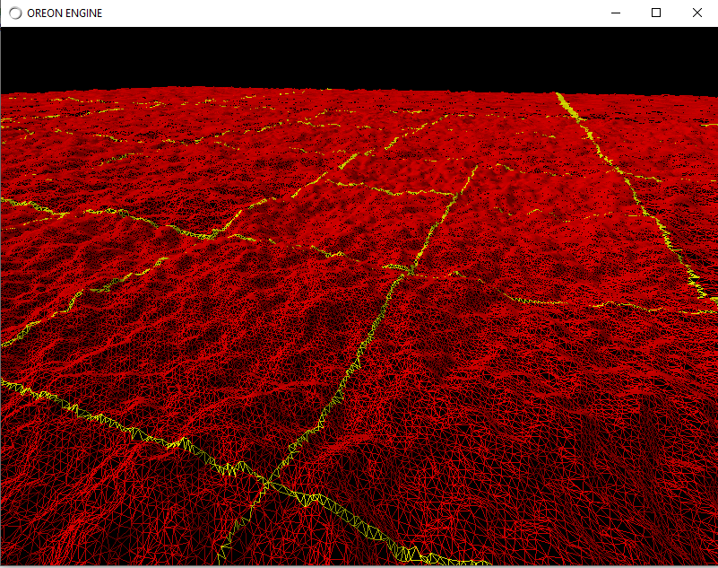
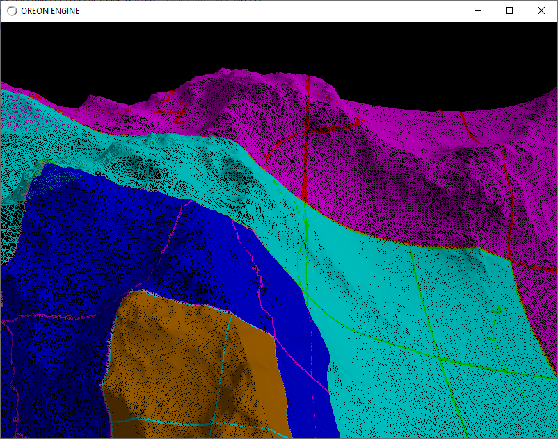

# Java-leven

Dual Contouring Chunking LODs with seams

Nick Gildea Dual Contouring https://github.com/nickgildea/leven implementation in Java LWJGL

CPU and OpenCL GPU implementations.

Features:
- Pointer based octree Dual contouring implementation;
- Linear octree Dual contouring implementations: <br>
  - Simple implementation, in series steps to calculate leafs data.
  - Transition implementation Linear octree dual contouring between simple implementation and NickGildea OpenCL DC implementation - TransitionLinearOctreeImpl.java. This is my favorite implementation.
  - Nick Gildea Leven Dual contouring implementation translated to Java CPU realization - LevenLinearOctreeImpl.java
  - Nick Gildea Leven OpenCL Dual contouring implementation. In this implementation LevenLinearOpenCLOctreeImpl.java I call OpenCL kernels in java .

## Build Instructions
The dependencies are:
  * Maven
  * Java 11
  * I used IntelliJ IDEA Community edition
 

## Usage

```java
public class ChunkOctreeWrapper extends GameObject {
 
    // Uncomment necessary implementation in constructor
    public ChunkOctreeWrapper() {
        //VoxelOctree voxelOctree = new PointerBasedOctreeImpl(true, meshGenCtx);
        //VoxelOctree voxelOctree = new SimpleLinearOctreeImpl(meshGenCtx);
        //VoxelOctree voxelOctree = new LevenLinearOpenCLOctreeImpl(kernelHolder, meshGenCtx);
        VoxelOctree voxelOctree = new TransitionLinearOctreeImpl(meshGenCtx);
        //VoxelOctree voxelOctree = new LevenLinearOpenCLOctreeImpl(kernelHolder, meshGenCtx);
        chunkOctree = new ChunkOctree(voxelOctree, meshGenCtx);
    }
}
```



OpenCL GPU implementation:


W/S/A/D - forward, backward, left, right

F1 - solid / wireframe

F2 - Show chunks octree bounds

F3 - enable / disable frustum culling

F4 - show bounds of the seam octree nodes 

middle mouse - camera walking

Use:

Oreon Engine (Java - OpenGL/Vulkan) https://github.com/fynnfluegge/oreon-engine

<br>

Other interesting implementations for research:

- Dual contouring in Unity. Chunks and compute shaders using<br>
https://github.com/Colt-Zero/DualContouringGPU

- Dual contouring chunks<br>
https://github.com/yixinxie/TestDC/