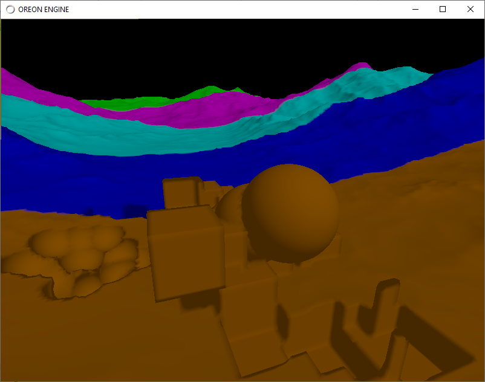

# Java-leven

Dual Contouring Chunking LODs with seams

Nick Gildea Dual Contouring https://github.com/nickgildea/leven implementation in Java LWJGL

CPU and OpenCL GPU implementations.

## Сhanges relative to the original solution
- fixed the appearance of holes in the seams between chunks
- fixed seam and chunk mesh overlap at seam intersections
- no double call to generate mesh for rendering and mesh for collisions - mesh is generated only once
- CPU multi-threaded implementation, which made it possible to improve performance in the CPU realization
- faster selectActiveChunkNodes and ReleaseInvalidatedNodes (no need to recursively traverse the whole tree to invalidate chunks - which improved performance)


## Features:
- Used JBullet physics engine (ray pick and collision detection);
- Many octree Dual contouring implementations:  
  Pointer based octree Dual contouring implementation,<br>
  Linear octree Dual contouring implementations: <br>
  - Simple implementation, in series steps to calculate leafs data.
  - Transition implementation Linear octree dual contouring between simple implementation and NickGildea OpenCL DC implementation - TransitionLinearOctreeImpl.java. This is my favorite implementation.
  - Nick Gildea Leven Dual contouring implementation translated to Java CPU realization - LevenLinearCPUOctreeImpl.java
  - Nick Gildea Leven OpenCL Dual contouring implementation. In this implementation LevenLinearGPUOctreeImpl.java I call OpenCL kernels in java .
- CSG operations (add/delete sphere/box brushes);  

## Build Instructions
please, perform
<br>
mvn clean install

The dependencies are:
  * Maven
  * Java 11
  * I used IntelliJ IDEA Community edition
 

## Usage

```java
public class ChunkOctreeWrapper extends GameObject {
 
    // Uncomment necessary implementation in constructor
    public ChunkOctreeWrapper() {
        //VoxelOctree voxelOctree = new PointerBasedOctreeImpl(true, meshGenCtx);
        //VoxelOctree voxelOctree = new SimpleLinearOctreeImpl(meshGenCtx);
        VoxelOctree voxelOctree = new TransitionLinearOctreeImpl(meshGenCtx);
        //VoxelOctree voxelOctree = new LevenLinearCPUOctreeImpl(meshGenCtx);
        //VoxelOctree voxelOctree = new LevenLinearGPUOctreeImpl(kernelHolder, meshGenCtx, ctx);
        chunkOctree = new ChunkOctree(voxelOctree, meshGenCtx);
    }
}
```


OpenCL GPU implementation:

CSG operations:



W/S/A/D - forward, backward, left, right

Tab - enable/disable mouse rotation mode

R_Mouse - perform CSG brush to object

R - switch CSG brush / sphere / cube

M - switch CSG operation (add/delete mode)

[ - increase brush size

] - decrease brush size 

F1 - solid / wireframe

F2 - Show chunks octree bounds

F3 - enable / disable frustum culling

F4 - show bounds of the seam octree nodes 

middle mouse with mouse move - camera walking (without change direction of movement)

right mouse - ray pick from mouse cursor to intersection point with landscape

arrows - change camera direction (with change direction of movement)
<br>
## Use:

JBullet - I use my modified version of JBullet https://github.com/proton2/jbullet

Oreon Engine (Java - OpenGL/Vulkan) https://github.com/fynnfluegge/oreon-engine

<br>

## Other interesting implementations for research:

- Nick Gildea Dual Contouring
https://github.com/nickgildea/leven

- Dual contouring chunks<br>
https://github.com/yixinxie/TestDC/